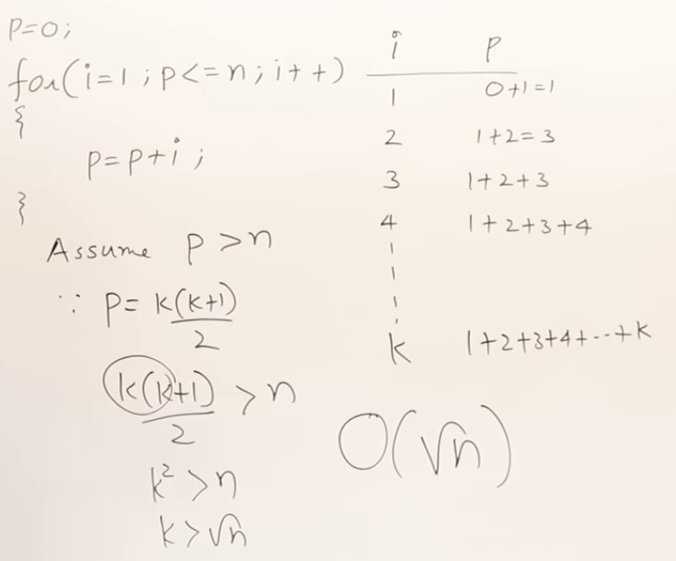
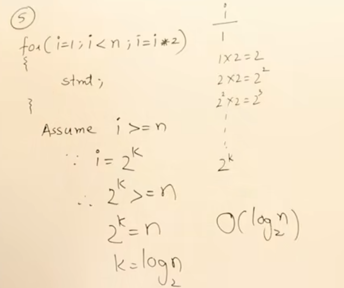
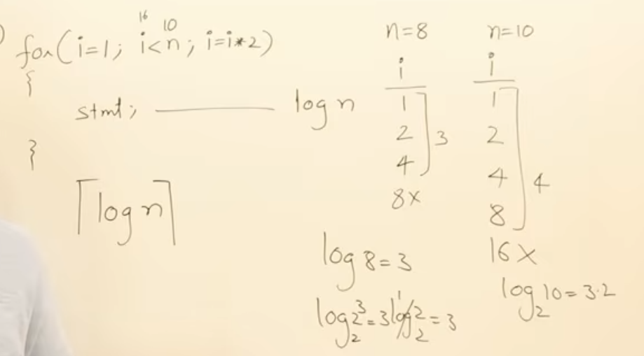

# ⏱️ Time Complexity Analysis: Loop Patterns & Frequency Counts

A comprehensive guide to analyzing algorithm time complexity step-by-step using line-by-line execution counts, algebraic derivations, and asymptotic notation (**Big-O**).

---

## 📑 Summary Cheat Sheet

| # | Pattern Name | Code Signature | Total Operations $f(n)$ | Time Complexity |
| :---: | :--- | :--- | :---: | :---: |
| **1** | Standard Increment Loop | `for (int i = 0; i < n; i++)` | $2n + 1$ | $\mathcal{O}(n)$ |
| **2** | Standard Decrement Loop | `for (int i = n; i > 0; i--)` | $2n + 1$ | $\mathcal{O}(n)$ |
| **3** | Fixed Step-Size Loop | `for (int i = 1; i < n; i += 20)` | $\approx 2\left(\frac{n}{20}\right) + 1$ | $\mathcal{O}(n)$ |
| **4** | Independent Nested Loops | `for i in 0..n { for j in 0..n { ... } }` | $2n^2 + 2n + 1$ | $\mathcal{O}(n^2)$ |
| **5** | Dependent Nested Loops | `for i in 0..n { for j in 0..i { ... } }` | $\frac{n(n-1)}{2} + \dots$ | $\mathcal{O}(n^2)$ |
| **6** | Triangular Sum Condition | `for (i = 1; p <= n; i++) { p += i; }` | $\approx \sqrt{2n}$ | $\mathcal{O}(\sqrt{n})$ |
| **7** | Multiplicative Step Loop | `for (int i = 1; i < n; i *= 2)` | $\approx 2\log_2 n + 1$ | $\mathcal{O}(\log n)$ |
| **8** | Division Decrement Loop | `for (int i = n; i >= 1; i /= 2)` | $\approx 2\log_2 n + 1$ | $\mathcal{O}(\log n)$ |
| **9** | Square Condition Loop | `for (int i = 0; i * i < n; i++)` | $\approx 2\sqrt{n} + 1$ | $\mathcal{O}(\sqrt{n})$ |
| **10** | Consecutive Sequential Loops | `for i in 0..n; for j in 0..n;` | $n + n = 2n$ | $\mathcal{O}(n)$ |
| **11** | Chained Double-Log Loop | `for i*=2 { p++ }; for j*=2 to p;` | $\log p = \log(\log n)$ | $\mathcal{O}(\log \log n)$ |
| **12** | Nested Linear $\times$ Log Loop | `for i in 0..n { for j*=2 to n { ... } }` | $\approx 2n\log_2 n + n$ | $\mathcal{O}(n \log n)$ |

---

## 1. Standard Linear Loop (Increment)

### 💻 Code
```c
for (int i = 0; i < n; i++)
{
    stmt;
}
```

### 🔍 Line-by-Line Execution Analysis

| Code Line | Execution Count | Explanation |
| :--- | :---: | :--- |
| `i = 0;` | $1$ time | Initialization executes once at the start. |
| `i < n;` | $n + 1$ times | Checks $n$ true conditions ($i = 0, 1, \dots, n-1$) + $1$ final false check ($i = n$). |
| `i++` | $n$ times | Increments $i$ after each successful body execution. |
| `stmt;` | $n$ times | Executes once for each valid loop iteration. |

### 🧮 Mathematical Derivation

$$
f(n) = \underbrace{(n + 1)}_{\text{condition checks}} + \underbrace{n}_{\text{statement executions}} = 2n + 1
$$

- **Highest Degree Term:** $n^1$
- **Drop Constants & Coefficients:** $2n + 1 \longrightarrow n$
- **Result:** **$\mathcal{O}(n)$** (Linear Time)

---

## 2. Standard Linear Loop (Decrement)

> [!NOTE]
> Iteration direction does not affect asymptotic complexity. Counting up from $0 \to n$ or down from $n \to 0$ performs the exact same number of operations.

### 💻 Code
```c
for (int i = n; i > 0; i--)
{
    stmt;
}
```

### 🔍 Line-by-Line Execution Analysis

| Code Line | Execution Count | Explanation |
| :--- | :---: | :--- |
| `i = n;` | $1$ time | Initialization runs once. |
| `i > 0;` | $n + 1$ times | Evaluates $n$ times as true ($i = n, n-1, \dots, 1$) + $1$ time as false ($i = 0$). |
| `i--` | $n$ times | Decrements $i$ after each body execution. |
| `stmt;` | $n$ times | Executes $n$ times in total. |

### 🧮 Mathematical Derivation

$$
f(n) = (n + 1) + n = 2n + 1
$$

- **Highest Degree Term:** $n^1$
- **Result:** **$\mathcal{O}(n)$** (Linear Time)

---

## 3. Fixed Step-Size Increment Loop ($i += c$)

### 💻 Code
```c
for (int i = 1; i < n; i += 20)
{
    stmt;
}
```

### 🔍 Line-by-Line Execution Analysis

| Code Line | Execution Count | Explanation |
| :--- | :---: | :--- |
| `i = 1;` | $1$ time | Runs once. |
| `i < n;` | $\lceil \frac{n}{20} \rceil + 1$ times | True for each step of size $20$, plus $1$ final false check. |
| `i += 20` | $\lceil \frac{n}{20} \rceil$ times | Increments by $20$ after each iteration. |
| `stmt;` | $\lceil \frac{n}{20} \rceil$ times | Executes $\approx \frac{n}{20}$ times. |

### 🧮 Mathematical Derivation

$$
f(n) = \left(\frac{n}{20} + 1\right) + \frac{n}{20} = \frac{2n}{20} + 1 = \frac{n}{10} + 1
$$

- **Order of Growth:** $\frac{1}{10} \cdot n^1$
- **Drop Constant Factor ($\frac{1}{10}$):** $\mathcal{O}\left(\frac{n}{20}\right) = \mathcal{O}(n)$
- **Result:** **$\mathcal{O}(n)$** (Linear Time)

> [!TIP]
> Any constant step stride $c > 0$ (such as $i += 2, i += 5, i += 20$) yields $\mathcal{O}(n)$.  
> *(Only multiplicative steps like $i *= 2$ reduce the complexity to $\mathcal{O}(\log n)$).*

---

## 4. Independent Nested Loops ($n \times n$)

### 💻 Code
```c
for (int i = 0; i < n; i++)
{
    for (int j = 0; j < n; j++)
    {
        stmt;
    }
}
```

### 🔍 Line-by-Line Execution Analysis

| Code Line | Execution Count | Explanation |
| :--- | :---: | :--- |
| **Outer Loop Check** `i < n` | $n + 1$ times | Evaluates $n$ times as true + $1$ time as false. |
| **Inner Loop Check** `j < n` | $n \times (n + 1)$ times | For each of the $n$ outer iterations, inner condition runs $n + 1$ times. |
| **Inner Statement** `stmt;` | $n \times n = n^2$ times | The inner body runs $n$ times for every outer loop pass. |

### 🧮 Mathematical Derivation

$$
\begin{aligned}
f(n) &= \underbrace{(n + 1)}_{\text{outer checks}} + \underbrace{n(n + 1)}_{\text{inner checks}} + \underbrace{n^2}_{\text{inner body}} \\
&= (n + 1) + (n^2 + n) + n^2 \\
&= 2n^2 + 2n + 1
\end{aligned}
$$

- **Dominant Term:** $n^2$
- **Result:** **$\mathcal{O}(n^2)$** (Quadratic Time)

---

## 5. Dependent Nested Loops ($j < i$)

### 💻 Code
```c
for (int i = 0; i < n; i++)
{
    for (int j = 0; j < i; j++)
    {
        stmt;
    }
}
```

### 🔍 Execution Trace Table

Let's trace how many times the inner loop runs for each value of $i$:

| Outer Index ($i$) | Inner Loop Runs ($j = 0 \to i-1$) | Iteration Count |
| :---: | :--- | :---: |
| $i = 0$ | $j < 0$ (immediately terminates) | $0$ |
| $i = 1$ | $j = 0$ | $1$ |
| $i = 2$ | $j = 0, 1$ | $2$ |
| $i = 3$ | $j = 0, 1, 2$ | $3$ |
| $\vdots$ | $\vdots$ | $\vdots$ |
| $i = n-1$ | $j = 0, 1, 2, \dots, n-2$ | $n - 1$ |

### 🧮 Mathematical Derivation (Arithmetic Series)

$$
\text{Total Inner Executions} = 0 + 1 + 2 + 3 + \dots + (n - 1) = \sum_{k=0}^{n-1} k
$$

Using the Gauss summation formula:
$$
f(n) = \frac{n(n - 1)}{2} = \frac{n^2 - n}{2} = \frac{1}{2}n^2 - \frac{1}{2}n
$$

- **Dominant Term:** $\frac{1}{2}n^2$
- **Drop Constant Factor ($\frac{1}{2}$):**
- **Result:** **$\mathcal{O}(n^2)$** (Quadratic Time)

---

## 6. Triangular Sum Condition Loop ($p \le n$)

### 💻 Code
```c
int p = 0;
for (int i = 1; p <= n; i++)
{
    p = p + i;
}
```

<p align="center">
  
</p>

### 🔍 Step-by-Step State Trace

Let $k$ be the total number of iterations executed when the loop stops:

| Iteration ($k$) | Value of $i$ | Value of $p$ at End of Iteration | Formula for $p$ |
| :---: | :---: | :--- | :---: |
| **1** | $1$ | $p = 0 + 1 = 1$ | $\frac{1(2)}{2} = 1$ |
| **2** | $2$ | $p = 1 + 2 = 3$ | $\frac{2(3)}{2} = 3$ |
| **3** | $3$ | $p = 3 + 3 = 6$ | $\frac{3(4)}{2} = 6$ |
| **4** | $4$ | $p = 6 + 4 = 10$ | $\frac{4(5)}{2} = 10$ |
| $\vdots$ | $\vdots$ | $\vdots$ | $\vdots$ |
| **$k$** | $k$ | $p = 1 + 2 + 3 + \dots + k$ | $\frac{k(k + 1)}{2}$ |

### 🧮 Mathematical Derivation

The loop condition tests `p <= n`. Therefore, the loop terminates at step $k$ as soon as:

$$
p > n \implies \frac{k(k + 1)}{2} > n
$$

Solving for $k$ in terms of $n$:

$$
\begin{aligned}
k(k + 1) &\approx 2n \\
k^2 + k &\approx 2n \\
k^2 &\approx 2n \quad (\text{ignoring lower-order term } k) \\
k &\approx \sqrt{2n} = \sqrt{2} \cdot \sqrt{n}
\end{aligned}
$$

- Since the loop executes $k$ iterations and $k = \mathcal{O}(\sqrt{n})$:
- **Result:** **$\mathcal{O}(\sqrt{n})$** (Square Root Time)

---

## 7. Multiplicative Step Loop ($i = i \times 2$ or $i = i \times c$)

### 💻 Code
```c
for (int i = 1; i < n; i = i * 2)
{
    stmt;
}
```

<p align="center">
  
</p>

### 🔍 Step-by-Step State Trace

Let $k$ be the iteration count:

| Iteration ($k$) | Value of $i$ | Power of 2 Form |
| :---: | :---: | :---: |
| **1** | $1$ | $2^0$ |
| **2** | $2$ | $2^1$ |
| **3** | $4$ | $2^2$ |
| **4** | $8$ | $2^3$ |
| $\vdots$ | $\vdots$ | $\vdots$ |
| **$k$** | $2^{k-1}$ | $2^{k-1}$ |

<p align="center">
  
</p>

### 🧮 Mathematical Derivation

The loop terminates when the condition `i < n` is violated (i.e., $i \ge n$):

$$
\begin{aligned}
2^k &\ge n \\
\log_2(2^k) &\ge \log_2(n) \\
k &\ge \log_2(n) \implies k = \lceil\log_2(n)\rceil
\end{aligned}
$$

> [!NOTE]
> If the multiplier is $3$ (`i = i * 3`), the loop executes $\lceil\log_3(n)\rceil$ times.  
> By the logarithm change-of-base rule:
> $$
> \log_3(n) = \frac{\log_2(n)}{\log_2 3} = \mathcal{O}(\log n)
> $$
> All logarithm bases are asymptotically equivalent in Big-O notation.

- **Result:** **$\mathcal{O}(\log n)$** (Logarithmic Time)

---

## 8. Division Decrement Loop ($i = i / 2$ or $i = i / c$)

### 💻 Code
```c
for (int i = n; i >= 1; i = i / 2)
{
    stmt;
}
```

### 🔍 Step-by-Step State Trace

Let $k$ be the iteration count:

| Iteration ($k$) | Value of $i$ | Exponential Form |
| :---: | :---: | :---: |
| **1** | $n$ | $\frac{n}{2^0}$ |
| **2** | $\frac{n}{2}$ | $\frac{n}{2^1}$ |
| **3** | $\frac{n}{4}$ | $\frac{n}{2^2}$ |
| $\vdots$ | $\vdots$ | $\vdots$ |
| **$k$** | $\frac{n}{2^{k-1}}$ | $\frac{n}{2^{k-1}}$ |

### 🧮 Mathematical Derivation

The loop condition tests `i >= 1`. The loop stops when $i < 1$:

$$
\begin{aligned}
\frac{n}{2^k} &< 1 \\
2^k &> n \\
k &> \log_2(n) \implies k = \lceil\log_2(n)\rceil
\end{aligned}
$$

> [!TIP]
> **Symmetry of Multiplication & Division:**  
> - Starting at $1$ and multiplying by $2$ until $n \longrightarrow \mathcal{O}(\log n)$
> - Starting at $n$ and dividing by $2$ until $1 \longrightarrow \mathcal{O}(\log n)$

- **Result:** **$\mathcal{O}(\log n)$** (Logarithmic Time)

---

## 9. Square Condition Loop ($i \times i < n$)

### 💻 Code
```c
for (int i = 0; i * i < n; i++)
{
    stmt;
}
```

### 🔍 Step-by-Step State Trace

| Iteration ($k$) | Value of $i$ | Tested Value ($i^2$) | Condition Check ($i^2 < n$) |
| :---: | :---: | :---: | :---: |
| **1** | $0$ | $0^2 = 0$ | $0 < n$ (True) |
| **2** | $1$ | $1^2 = 1$ | $1 < n$ (True) |
| **3** | $2$ | $2^2 = 4$ | $4 < n$ (True) |
| **4** | $3$ | $3^2 = 9$ | $9 < n$ (True) |
| $\vdots$ | $\vdots$ | $\vdots$ | $\vdots$ |
| **$k$** | $k$ | $k^2$ | $k^2 \ge n$ (Loop Stops) |

### 🧮 Mathematical Derivation

The loop terminates when $i^2 \ge n$:

$$
\begin{aligned}
k^2 &\ge n \\
k &\ge \sqrt{n} \implies k = \lceil\sqrt{n}\rceil
\end{aligned}
$$

- **Total Iterations:** $\lceil\sqrt{n}\rceil$
- **Result:** **$\mathcal{O}(\sqrt{n})$** (Square Root Time)

---

## 10. Consecutive Independent Loops (Sequential $n + n$)

### 💻 Code
```c
// Loop 1
for (int i = 0; i < n; i++)
{
    stmt1;
}

// Loop 2
for (int j = 0; j < n; j++)
{
    stmt2;
}
```

### 🔍 Execution Analysis

When two loops run sequentially (not nested), their execution costs add together:

$$
\begin{aligned}
f(n) &= \text{Cost(Loop 1)} + \text{Cost(Loop 2)} \\
&= (2n + 1) + (2n + 1) \\
&= 4n + 2
\end{aligned}
$$

### 🧮 Mathematical Derivation

$$
\mathcal{O}(n) + \mathcal{O}(n) = \mathcal{O}(n + n) = \mathcal{O}(2n) = \mathcal{O}(n)
$$

> [!NOTE]
> Sequential loops are additive. Always take the dominant term:  
> $\mathcal{O}(n) + \mathcal{O}(n^2) \implies \mathcal{O}(n^2)$.

- **Result:** **$\mathcal{O}(n)$** (Linear Time)

---

## 11. Chained Logarithmic Loops (Double Log $\log \log n$)

### 💻 Code
```c
int p = 0;

// Loop 1: Computes p = log2(n)
for (int i = 1; i < n; i = i * 2)
{
    p++;
}

// Loop 2: Runs logarithmic times with respect to p
for (int j = 1; j < p; j = j * 2)
{
    stmt;
}
```

### 🔍 Step-by-Step Analysis

1. **First Loop:**
   - Counter $i$ doubles each step: $i = 1, 2, 4, 8, \dots < n$.
   - The loop runs $k_1 = \lfloor\log_2 n\rfloor$ times.
   - Therefore, variable $p$ finishes with value:
     $$
     p = \lfloor\log_2 n\rfloor
     $$

2. **Second Loop:**
   - Counter $j$ doubles each step: $j = 1, 2, 4, \dots < p$.
   - The loop runs $k_2 = \lfloor\log_2 p\rfloor$ times.

3. **Combined Complexity:**
   - Substitute $p = \log_2 n$ into the second loop count:
     $$
     k_2 = \log_2(p) = \log_2(\log_2 n)
     $$

- **Result:** **$\mathcal{O}(\log \log n)$** (Double Logarithmic Time)

---

## 12. Nested Linear $\times$ Logarithmic Loop ($n \times \log n$)

### 💻 Code
```c
for (int i = 0; i < n; i++)
{
    for (int j = 1; j < n; j = j * 2)
    {
        stmt;
    }
}
```

### 🔍 Line-by-Line Execution Analysis

| Loop Level | Stride / Condition | Executions per Pass | Total Executions |
| :--- | :--- | :---: | :---: |
| **Outer Loop ($i$)** | Linear increment ($i++$) | $n$ iterations | $n$ |
| **Inner Loop ($j$)** | Multiplicative doubling ($j *= 2$) | $\approx \log_2 n$ iterations | $n \times \log_2 n$ |
| **Inner Body (`stmt`)**| Executes on every inner step | $1$ per inner pass | $n \log_2 n$ |

### 🧮 Mathematical Derivation

$$
\begin{aligned}
f(n) &= \sum_{i=0}^{n-1} \left(\sum_{k=1}^{\lceil\log_2 n\rceil} 1\right) \\
&= \sum_{i=0}^{n-1} \lceil\log_2 n\rceil \\
&= n \cdot \lceil\log_2 n\rceil
\end{aligned}
$$

- **Dominant Term:** $n \log_2 n$
- **Result:** **$\mathcal{O}(n \log n)$** (Linearithmic Time)

---

## 🎯 Quick Rules of Thumb for Loop Analysis

> [!IMPORTANT]
> ### 1. Single Loop Variable Transformations
> | Update Operation | Example | Resulting Complexity |
> | :--- | :--- | :---: |
> | Linear Increment / Decrement | `i++`, `i--`, `i += 5` | $\mathcal{O}(n)$ |
> | Multiplicative / Division Factor | `i *= 2`, `i /= 2`, `i *= 3` | $\mathcal{O}(\log n)$ |
> | Quadratic Condition | `i * i < n` | $\mathcal{O}(\sqrt{n})$ |
> | Arithmetic Accumulation Condition | `p += i; p <= n` | $\mathcal{O}(\sqrt{n})$ |
> 
> ### 2. Combining Multiple Loops
> - **Sequential Loops ($L_1 \text{ followed by } L_2$):**  
>   $$\text{Complexity} = \mathcal{O}(L_1) + \mathcal{O}(L_2) = \max(\mathcal{O}(L_1), \mathcal{O}(L_2))$$
> - **Nested Loops ($L_2 \text{ inside } L_1$):**  
>   $$\text{Complexity} = \mathcal{O}(L_1) \times \mathcal{O}(L_2)$$
> - **Dependent Nested Loops ($j < i$):**  
>   $$\sum_{i=1}^n i = \frac{n(n+1)}{2} \implies \mathcal{O}(n^2)$$
